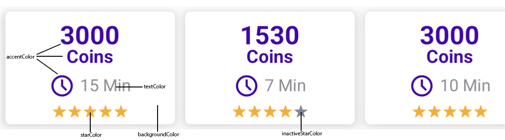
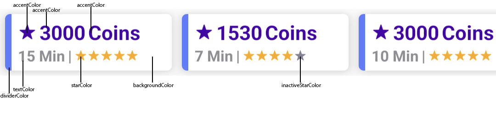

# CPX Research Android SDK

#### Monetize your product with fun surveys.

We will make it easy for you: Simply implement our solution and be ready to start monetizing your product immediately!
Let users earn your virtual currency by simply participating in exciting and well paid online surveys!

This SDK is owned by [MakeOpinion GmbH](http://www.makeopinion.com).

[Learn more.](https://cpx-research.com/)

# Table of Contents

- [Prerequisites](#prerequisites)
- [Installation](#installation)
- [Usage](#usage)
- [ProGuard](#proguard)
- [Logging](#logging)

# Prerequisites

- Android SDK 21 (Lollipop) or newer

# Preview


# Installation

1. Add it in your **root** build.gradle at the end of repositories:

```gradle
	allprojects {
		repositories {

			maven { url 'https://jitpack.io' }
		}
	}
```

2. Add it in your **module** build.gradle in the dependencies section:

```gradle
dependencies {
	implementation 'com.github.MakeOpinionGmbH:cpx-research-SDK-Android:1.5.7'
}
```

# Usage

## Initialize the library

[For a Java documentation click here](READMEJAVA.md)

Enter the following code early in your App's life cycle, for example in the App's Application class. You can extra information like subIds, email or an entire array of specific data that will be sent back to you when you finish a transaction.

```kotlin
val style = CPXStyleConfiguration(
            SurveyPosition.SideRightNormal,
            "Earn up to 3 Coins in<br> 4 minutes with surveys",
            20,
            "#ffffff",
            "ffaf20",
            true)

val config = CPXConfigurationBuilder(
            "<Your app id>",
            "<Your external user id>",
            "<Your secure hash>",
            style)
            //.withSubId1("subId1")
            //.withSubId2("subId2")
            //.withEmail("user@email.com")
            //.withExtraInfo(arrayOf("value1", "value2"))
            //.withCustomConfirmCloseDialogTexts("Title", "msg", "ok", "cancel")
            .build()

val cpx = CPXResearch.init(config)
```

## Using the SDK's banner for overlays

In your Activity activate the automatic banner display and set the delegate to handle CPX Research events.

```kotlin
    override fun onCreate(savedInstanceState: Bundle?) {
        super.onCreate(savedInstanceState)
        setContentView(R.layout.activity_main)

        (application as? CPXApplication)?.let {
            it.cpxResearch().setSurveyVisibleIfAvailable(true, this)
        }
    }
```

## Using the CPX Survey Cards

To use a recycler view with a default survey card you can get a fully prepared RecyclerView from the SDK. Add this to a parent view on your activity. The recycler view also handles click and update events for you.

### CPXCardStyle
#### DEFAULT

#### SMALL


```kotlin
override fun onCreate(savedInstanceState: Bundle?) {
        super.onCreate(savedInstanceState)
        setContentView(R.layout.activity_main)
        parentView = findViewById(R.id.container)

        val cardConfig = CPXCardConfiguration.Builder()
                    .build() //don't set anything, just use default values

        // OR

        val cardConfig = CPXCardConfiguration.Builder()
                    .accentColor(Color.parseColor("#41d7e5"))
                    .backgroundColor(Color.WHITE)
                    .starColor(Color.parseColor("#ffaa00"))
                    .inactiveStarColor(Color.parseColor("#dfdfdf"))
                    .textColor(Color.DKGRAY)
                    .dividerColor(Color.parseColor("#5A7DFE")) // only for SMALL style
                    .promotionAmountColor(Color.RED) // text color for promotion offers
                    .cardsOnScreen(4) // set how many cards are initially visible on screen
                    .cornerRadius(4f) // set the corner radius of cards
                    .maximumSurveys(4) // set maximum amount of surveys showns
                    .paddingHorizontal(16f) // set left/right
                    //.paddingVertical(16f) // set top/bottom
                    //.padding(16f) // set all borders
                    //.paddingLeft(16f) // just set the left
                    //.paddingRight(16f) // just set the right
                    //.paddingTop(16f) // just set the top
                    //.paddingBottom(16f) //just set the bottom
                    //.cpxCardStyle(CPXCardStyle.DEFAULT) // set card style
                    //.fixedCPXCardWidth(132) // instead of autocalculate use a fixed card width
                    //.currencyPrefixImage(R.drawable.cpx_icon_star) // for SMALL style only: set an optional image before the currency text
                    //.hideCurrencyName(true) // hides the currency name behind the amount
                    //.hideRatingAmount(false) // set to false to show the total amount of ratings behind the stars
                    //.showCurrencyBeforeValue(true) // set to true if you want to have the currency name in front (SMALL style) or above (DEFAULT style) of the amount
                    .build()

        (application as? CPXApplication)?.let {
            it.cpxResearch().insertCPXResearchCardsIntoContainer(this, parentView, cardConfig)
        }
}
```

## Handling events of the SDK

In your Activity set the delegate to handle CPX Research events. In Kotlin

```kotlin
    override fun onCreate(savedInstanceState: Bundle?) {
        super.onCreate(savedInstanceState)
        setContentView(R.layout.activity_main)

        (application as? CPXApplication)?.let {
            it.cpxResearch().registerListener(object : CPXResearchListener {
                override fun onSurveysUpdated() {
                    Log.d("CPX", "surveys updated.")
                    // get current surveys if needed with it.cpxResearch().surveys
                }

                override fun onTransactionsUpdated(unpaidTransactions: List<TransactionItem>) {
                    Log.d("CPX", "transactions updated.")
                    for (item in unpaidTransactions) {
                        Log.d("CPX", "${item.earningPublisher}")
                    }
                }

                override fun onSurveysDidOpen() {
                    Log.d("CPX", "surveys opened.")
                }

                override fun onSurveysDidClose() {
                    Log.d("CPX", "surveys closed.")
                }

                override fun onSurveyDidOpen() {
                    Log.d("CPX", "single survey opened.")
                }

                override fun onSurveyDidClose() {
                    Log.d("CPX", "single survey closed.")
                }
            })
        }
    }
```

## Additional functions of the SDK

Tell the library to show the surveys list, call

```kotlin
(activity?.application as? CPXApplication)?.let { app ->
    app.cpxResearch().openSurvey(this)
}
```

Show a specific survey

```kotlin
(activity?.application as? CPXApplication)?.let { app ->
    app.cpxResearch().openSurvey(this, surveyId)
}
```

Mark a transaction as paid

```kotlin
(activity?.application as? CPXApplication)?.let { app ->
    app.cpxResearch().markTransactionAsPaid(transactionId, messageId)
}
```

Manually request an update to the surveys
```kotlin
(activity?.application as? CPXApplication)?.let { app ->
    app.cpxResearch().requestSurveyUpdate(false) // set parameter to true if you also want to update the unpaid transactions
}
```

Access all current surveys for the user
```kotlin
(activity?.application as? CPXApplication)?.let { app ->
    val surveys = app.cpxResearch().surveys
}
```

Access all current unpaid transactions for the user
```kotlin
(activity?.application as? CPXApplication)?.let { app ->
    val transactions = app.cpxResearch().unpaidTransactions
}
```

## How to add an own application class

1. Create a class extending Application class like in Kotlin

```kotlin
class CPXApplication: Application() { }
```

2. Add this Application-class to your App's Manifest

```xml
<application
    android:name=".CPXApplication"
    ...
</application>
```

3. In your Application class overwrite the onCreate Method and add the variables/getter.

```kotlin
override fun onCreate() {
    super.onCreate()
    initCPX(this)
}

private var cpxResearch: CPXResearch? = null

fun cpxResearch(): CPXResearch {
    return cpxResearch!!
}

private fun initCPX(context: Context) {
    val style = CPXStyleConfiguration(
        SurveyPosition.SideRightNormal,
        "Earn up to 3 Coins in<br> 4 minutes with surveys",
        20,
        "#ffffff",
        "#ffaf20",
        true)

    val config = CPXConfigurationBuilder(
        "<Your app id>",
        "<Your external user id>",
        "<Your secure hash>",
        style)
        .build()

    val cpx = CPXResearch.init(context, config)
    cpxResearch = cpx
}
```

# ProGuard
To use ProGuard minifying for your app, add the rules to your app's proguard-rules.pro file to exclude the SDK from being minified:
```groovy
-keep class com.makeopinion.cpxresearchlib.** { *; }
```

To also surpress warnings from the underlying okhttp library you can add the following as well:
```groovy
-dontwarn org.bouncycastle.jsse.BCSSLSocket
-dontwarn org.bouncycastle.jsse.BCSSLParameters
-dontwarn org.bouncycastle.jsse.provider.BouncyCastleJsseProvider
-dontwarn org.conscrypt.*
-dontwarn org.openjsse.javax.net.ssl.SSLParameters
-dontwarn org.openjsse.javax.net.ssl.SSLSocket
-dontwarn org.openjsse.net.ssl.OpenJSSE
```

# Logging
CPXResearch provides an internal debug logging mechanism that can be activated calling the function setLogMode(boolean). If set to true the SDK will log in memory.
Logs can be exported calling exportLog(onActivity).
